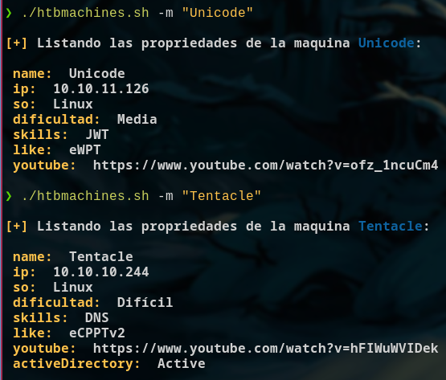

# Buscador de maquinas HTB 

Aprendiendo con la academia [hack4u](https://hack4u.io/cursos/introduccion-a-linux/) con el curso de **Introducción a Linux** en la sección "Scripting en Bash - Principiante a Avanzado".

Este buscador nos permitirá filtrar por palabras clave de cara a las máquinas que resolvemos de la plataforma de HackTheBox. Podremos filtrar por un nombre de máquina, obtener información de la máquina en base a una IP dada, filtrar por el sistema operativo, filtrar por nombres de certificación, filtrar por la dificultad de una máquina e incluso por las técnicas vistas en cada una de ellas.

